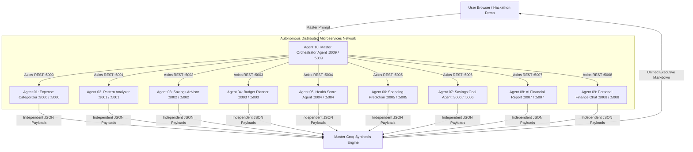
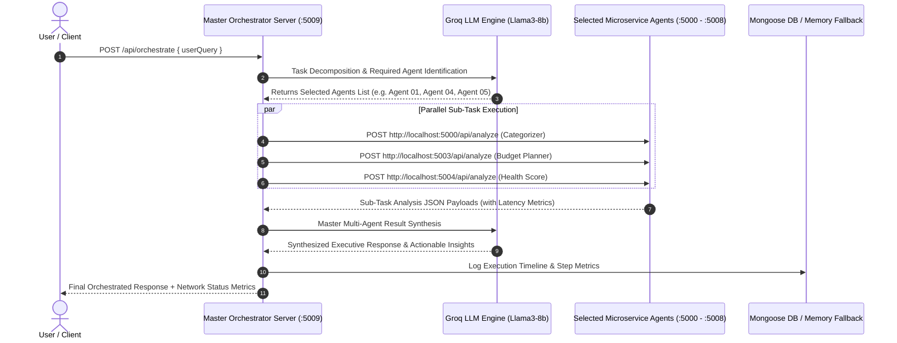

# FinanceAgentHub: Production-Ready Distributed Multi-Agent AI System


**FinanceAgentHub** is a state-of-the-art, production-ready **Distributed Multi-Agent AI System** designed for high-performance financial intelligence, predictive temporal analytics, automated budgeting, risk scoring, and interactive conversational guidance. 

The ecosystem consists of **10 completely independent, self-contained AI Agent applications**, each operating with its own dedicated **React 19 + Vite + Tailwind CSS** client and **Node.js + Express + Groq SDK + Mongoose** server. All microservices interact seamlessly under the governance of a master **Orchestrator Agent**.

---

## 📑 Table of Contents
1. [System Architecture & Topology](#-system-architecture--topology)
2. [Multi-Agent Orchestration Workflow](#-multi-agent-orchestration-workflow)
3. [Microservices Network & Port Directory](#-microservices-network--port-directory)
4. [Detailed Breakdown of the 10 AI Agents](#-detailed-breakdown-of-the-10-ai-agents)
5. [Resiliency & Fallback System Design](#-resiliency--fallback-system-design)
6. [Technology Stack](#-technology-stack)
7. [Installation & Local Execution Guide](#-installation--local-execution-guide)
8. [Master API Reference](#-master-api-reference)
9. [Environment Configuration](#-environment-configuration)
10. [Hackathon Pitch & Presentation Script](#-hackathon-pitch--presentation-script)
11. [Production Deployment Guide](#-production-deployment-guide)
12. [Future Roadmap & Enhancements](#-future-roadmap--enhancements)

---

## 🏛 System Architecture & Topology

Each micro-application in **FinanceAgentHub** operates in total isolation on dedicated network ports, allowing independent scaling, zero single-point-of-failure risks, and strict clean architecture domain boundaries.



---

## 🔄 Multi-Agent Orchestration Workflow



---

## 📊 Microservices Network & Port Directory

| Agent ID | Agent Application Name | Folder Name | Client Port | Server Port | Core Function |
| :--- | :--- | :--- | :--- | :--- | :--- |
| **01** | Expense Categorizer Agent | `01-expense-categorizer-agent` | `:3000` | `:5000` | AI transaction categorization, confidence scores, & reasoning |
| **02** | Spending Pattern Analyzer | `02-spending-pattern-analyzer-agent` | `:3001` | `:5001` | History analysis, weekly/monthly trends, & heatmaps |
| **03** | Smart Savings Advisor | `03-smart-savings-advisor-agent` | `:3002` | `:5002` | Personalized savings advice & financial risk warnings |
| **04** | Budget Planner Agent | `04-budget-planner-agent` | `:3003` | `:5003` | 50/30/20 category budget allocations & spending limits |
| **05** | Financial Health Score | `05-financial-health-score-agent` | `:3004` | `:5004` | Financial Health Score (0-100), Grade, & 180-day roadmap |
| **06** | Spending Prediction Agent | `06-spending-prediction-agent` | `:3005` | `:5005` | Next month spending forecast, 3-month trends, & risk level |
| **07** | Savings Goal Agent | `07-savings-goal-agent` | `:3006` | `:5006` | Goal milestone tracking, completion ETA dates, & tips |
| **08** | AI Financial Report Agent | `08-ai-financial-report-agent` | `:3007` | `:5007` | Executive monthly financial report synthesis & PDF download |
| **09** | Personal Finance Chat | `09-personal-finance-chat-agent` | `:3008` | `:5008` | Interactive AI finance chatbot with voice-ready speech hook |
| **10** | Master Orchestrator Agent | `10-orchestrator-agent` | `:3009` | `:5009` | Multi-agent task routing, retries, & master synthesis |

---

## 🤖 Detailed Breakdown of the 10 AI Agents

### 1. Expense Categorizer Agent (`01-expense-categorizer-agent`)
- **Ports**: Client `:3000` | Server `:5000`
- **Purpose**: Automatically classifies raw transaction items into standardized categories (e.g. Food & Dining, Utilities, Entertainment, Transit).
- **Outputs**: Expense Category, Confidence Score (0-1), AI Justification.

### 2. Spending Pattern Analyzer Agent (`02-spending-pattern-analyzer-agent`)
- **Ports**: Client `:3001` | Server `:5001`
- **Purpose**: Evaluates temporal spending history to uncover behavioral patterns.
- **Outputs**: Top Categories, Weekly & Monthly Trends, Category Spending Heatmaps, AI Insights.

### 3. Smart Savings Advisor Agent (`03-smart-savings-advisor-agent`)
- **Ports**: Client `:3002` | Server `:5002`
- **Purpose**: Analyzes income vs operating expenses to generate personalized wealth-building recommendations.
- **Outputs**: Estimated Monthly Savings, Savings Tips, Financial Warnings, Opportunity Metrics.

### 4. Budget Planner Agent (`04-budget-planner-agent`)
- **Ports**: Client `:3003` | Server `:5003`
- **Purpose**: Generates intelligent 50/30/20 category budget breakdowns.
- **Outputs**: Needs / Wants / Savings Allocation Cards, Category Spending Limits, Allocation Donut Charts.

### 5. Financial Health Score Agent (`05-financial-health-score-agent`)
- **Ports**: Client `:3004` | Server `:5004`
- **Purpose**: Computes a holistic financial score (0-100) based on liquidity, debt ratio, and savings velocity.
- **Outputs**: Composite Health Score, Letter Grade (A-F), Risk Level, Radial SVG Gauge, 30/90/180-Day Roadmap.

### 6. Spending Prediction Agent (`06-spending-prediction-agent`)
- **Ports**: Client `:3005` | Server `:5005`
- **Purpose**: Predictive temporal AI forecasting future cash outflows and liquidity risk.
- **Outputs**: Next Month Spending Forecast, Confidence Score %, 3-Month Projection Chart, Seasonal Risk Factors.

### 7. Savings Goal Agent (`07-savings-goal-agent`)
- **Ports**: Client `:3006` | Server `:5006`
- **Purpose**: Tracks target financial milestones and predicts completion timelines.
- **Outputs**: Percentage Progress Bar, Completion Date (ETA), Remaining Balance, AI Acceleration Suggestions.

### 8. AI Financial Report Agent (`08-ai-financial-report-agent`)
- **Ports**: Client `:3007` | Server `:5007`
- **Purpose**: Synthesizes formal monthly financial reports with PDF export capabilities.
- **Outputs**: Executive Summary, Income / Expense / Savings Summaries, Cash Flow Distribution Chart, PDF Download Button.

### 9. Personal Finance Chat Agent (`09-personal-finance-chat-agent`)
- **Ports**: Client `:3008` | Server `:5008`
- **Purpose**: Conversational financial advisor bot featuring session history and speech recognition hooks.
- **Outputs**: Rich Markdown Chat Output, Suggested Query Chips, Speech Synthesis (TTS), Voice Input (STT Hook).

### 10. Master Orchestrator Agent (`10-orchestrator-agent`)
- **Ports**: Client `:3009` | Server `:5009`
- **Purpose**: Central routing engine that receives complex multi-intent requests, dispatches REST API tasks to child agents, and synthesizes unified master responses.
- **Outputs**: Connected Agents Network Status, Live Execution Timeline, Sub-Agent Response Time Metrics, Master Synthesized Answer.

---

## 🛡 Resiliency & Fallback System Design

To guarantee **100% operational uptime** even without an active internet connection, local MongoDB instance, or valid Groq API key, every agent incorporates a **Dual Fallback System**:

1. **MongoDB Connection Failover**:
   - Mongoose connections execute with `serverSelectionTimeoutMS: 3000`.
   - If local MongoDB (`mongodb://localhost:27017`) is offline, controllers automatically failover to structured **In-Memory Storage Repositories** (`memoryStore.util.js`).
2. **Groq AI Heuristic Fallback Engine**:
   - If `GROQ_API_KEY` is omitted, invalid, or rate-limited, services automatically failover to internal **Analytical Heuristic Engines**, guaranteeing instant valid responses.

---

## 🛠 Technology Stack

- **Frontend**: React 19, Vite, Tailwind CSS, Framer Motion, Lucide React Icons, Axios, React Router v6.
- **Backend**: Node.js (v18+), Express.js (v4.21), Groq SDK (`llama3-8b-8192`), Mongoose (v8.9), dotenv, Cors, Helmet, Morgan, Express Rate Limit.
- **Architecture**: SOLID Principles, Clean Architecture (Layered Controller-Service-Model-Route-Middleware pattern).

---

## 🚀 Installation & Local Execution Guide

### Prerequisites
- **Node.js**: v18.0.0 or higher
- **npm**: v9.0.0 or higher

### Step 1: Clone Repository
```bash
git clone https://github.com/your-username/FinanceAgentHub.git
cd FinanceAgentHub
```

### Step 2: Running Any Microservice Agent

To run any agent application (e.g. **Agent 10: Master Orchestrator**):

#### Terminal 1: Start Backend Server
```bash
cd 10-orchestrator-agent/server
npm install
npm run dev
```
> *Server starts on `http://localhost:5009`*

#### Terminal 2: Start Frontend Client
```bash
cd 10-orchestrator-agent/client
npm install
npm run dev
```
> *Client starts on `http://localhost:3009`*

---

## 📚 Master API Reference

All agent responses follow the standardized **JSON API Envelope**:
```json
{
  "agent": "Agent Application Name",
  "status": "success",
  "result": { ... }
}
```

### Orchestrator Master Dispatch (`POST /api/orchestrate`)
- **URL**: `http://localhost:5009/api/orchestrate`
- **Request Body**:
  ```json
  {
    "userQuery": "Categorize my $85 Starbucks transaction, check my budget limits, and assess my financial health score."
  }
  ```
- **Response**:
  ```json
  {
    "agent": "Orchestrator Agent",
    "status": "success",
    "result": {
      "userQuery": "Categorize my $85 Starbucks transaction...",
      "selectedAgents": [
        "01-expense-categorizer-agent",
        "04-budget-planner-agent",
        "05-financial-health-score-agent"
      ],
      "agentResponses": [...],
      "orchestrationTimeline": [...],
      "totalExecutionTimeMs": 335,
      "finalSynthesizedResponse": "The $85 purchase at Starbucks was categorized as **Food & Dining**..."
    }
  }
  ```

---

## ⚙️ Environment Configuration

Create `.env` inside `server/` of any agent:
```env
PORT=5009
NODE_ENV=development
GROQ_API_KEY=your_groq_api_key_here
MONGODB_URI=mongodb://localhost:27017/orchestrator_db
CORS_ORIGIN=http://localhost:3009
```

---

## 🎤 Hackathon Pitch & Presentation Script

1. **The Problem**: Managing personal finances requires juggling fragmented tools for budgeting, forecasting, risk assessment, and chat assistance.
2. **The Solution**: **FinanceAgentHub**—A distributed multi-agent financial intelligence network where autonomous specialized microservices collaborate under a central Orchestrator.
3. **Key Highlights**:
   - 10 Independent Micro-Applications running cleanly on dedicated ports.
   - Sub-second parallel REST API dispatch & execution timeline tracking.
   - Dual Fallback Resiliency (100% uptime with or without MongoDB/Groq keys).
   - Rich dark theme UI with Framer Motion, interactive charts, PDF exports, and voice recognition hooks.

---

## 🔮 Future Roadmap & Enhancements

- [ ] **Plaid API Ingestion**: Direct bank account linking for live transaction syncing.
- [ ] **Native Whisper Speech-to-Text**: Voice AI processing directly integrated into all chat modules.
- [ ] **Docker & Kubernetes Deployment**: Containerization with Docker Compose and Kubernetes Helm charts.
- [ ] **OpenTelemetry Tracing**: Distributed tracing across microservice REST calls.

---

## 📄 License

Distributed under the **MIT License**. Created for High-Performance Multi-Agent AI Applications.
